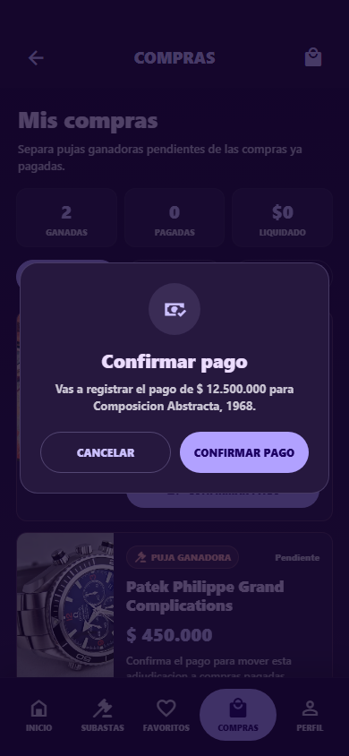
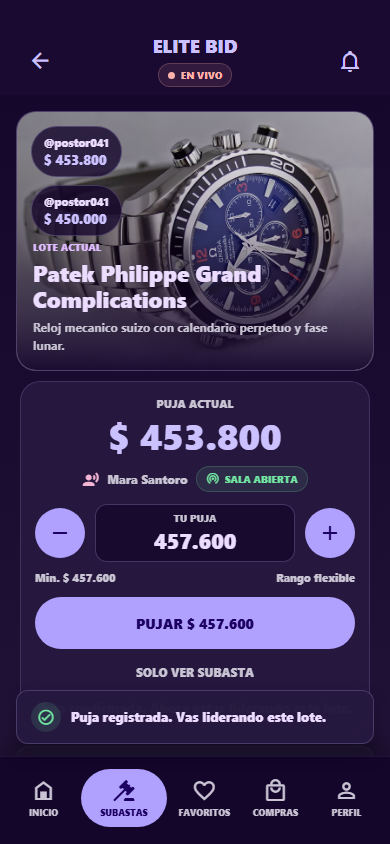

# Checklist QA - Segunda Entrega EliteBid

## Entorno probado

- Fecha: 26/05/2026
- Plataforma: Web local con Expo
- Viewport usado para capturas: mobile 390 x 844
- URL local usada: `http://127.0.0.1:3002`
- Usuario de prueba: `alejandro@elitebid.com / Elite1234`

## Comandos de validacion

```bash
npm run web -- --port 3002
npm run qa:flow
npx expo export --platform web
```

Resultado esperado: el flujo automatizado pasa completo, el bundle compila sin errores y la app carga la pantalla de login.

## Checklist funcional

| Flujo | Estado | Evidencia |
| --- | --- | --- |
| Login con usuario de prueba | OK | Captura 01 y 02 |
| Home con subastas abiertas y barra inferior | OK | Captura 02 |
| Compras distingue pujas ganadoras pendientes | OK | Captura 03 |
| Confirmar pago mueve una adjudicacion a compra pagada | OK | Captura 04 |
| Confirmar pago muestra modal preventivo antes de registrar | OK | Captura 08 |
| Sala en vivo muestra lote, puja actual, selector de monto y CTA | OK | Captura 05 |
| Sala en vivo muestra toast al registrar una puja | OK | Captura 09 |
| Perfil muestra datos del usuario y estadisticas | OK | Captura 06 |
| Penalidades permite pagar o marcar como solucionada | OK | Captura 07 |

## Checklist visual

- Barra inferior fija visible y consistente en las pantallas principales.
- CTA principal de sala en vivo visible sobre la barra inferior.
- Estados de compra diferenciados por color y texto:
  - `Puja ganadora`
  - `Compra pagada`
- Popups/toasts visibles al confirmar acciones.
- Penalidades con acciones claras:
  - `Pagar ahora`
  - `Solucionada`

## Capturas

### 01 - Login


### 02 - Home


### 03 - Compras con pujas ganadoras pendientes


### 04 - Compras con pago confirmado


### 05 - Sala en vivo


### 06 - Perfil


### 07 - Penalidades


### 08 - Modal de confirmar pago



### 09 - Toast de puja registrada



## Riesgos pendientes

- No se probo en dispositivo fisico Android/iOS.
- La validacion visual sigue siendo manual/asistida por navegador.
- El backend sigue siendo local, no un servicio Express deployado.
- El feed de sala en vivo no usa WebSocket real todavia.
